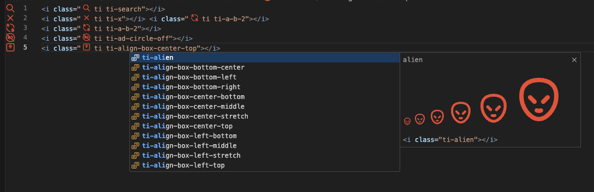

# Tabler Icons IntelliSense (ti) for VS Code / Cursor

A lightweight VS Code / Cursor extension that improves the experience of using **Tabler Icons CSS classes**.

## Screenshot



## Prerequisites (Tabler Icons CSS)

This extension provides **IntelliSense and previews only**. To actually render the icons in your app/website, you must include Tabler Icons CSS.

### CDN

```html
<link
  rel="stylesheet"
  href="https://cdn.jsdelivr.net/npm/@tabler/icons-webfont@latest/dist/tabler-icons.min.css"
/>
```

### npm

```bash
npm i @tabler/icons-webfont
```

Then import it in your app (example):

```js
import "@tabler/icons-webfont/dist/tabler-icons.min.css";
```

Tabler Icons CSS (webfont) project:
- https://github.com/tabler/tabler-icons/tree/main/packages/icons-webfont

## Installation

- Install from the VS Code Marketplace (also works in Cursor).
- Or install the packaged `.vsix` via **Extensions → … → Install from VSIX…**.

## Features

- **Autocomplete** for `ti ti-...` class names
- **Hover / suggestion preview** with an SVG icon preview
- **Inline decoration**: a small icon shown in the editor next to `ti ti-...`

## Usage

Type a Tabler class in your HTML/Svelte/React files:

```html
<i class="ti ti-search text-xl"></i>
<i class="ti ti-x text-xl"></i>
```

- Start typing `ti ti-` and pick an icon from the completion list.
- Hover the suggested class to see a larger SVG preview.

## Supported languages

- HTML
- Svelte
- JavaScript React
- TypeScript React

## Development

```bash
npm install
npm run build

# Package a .vsix
npx vsce package
```

> Tip: If you package often, you can install `vsce` globally, but using `npx` is fine.

## License

See the `LICENSE` file.